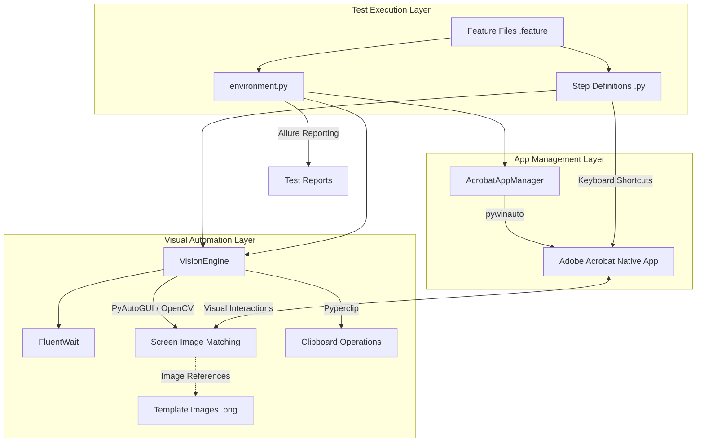

# Adobe Acrobat Desktop Automation Architecture

This document provides a comprehensive overview of the architecture used for automating the Adobe Acrobat desktop application. It explains the core components, technology stack, and execution flow of the automation suite.

## 1. Architecture Diagram

## 2. Overview
The automation framework is designed to interact with the native desktop application of Adobe Acrobat. Because desktop applications (especially rich ones like Acrobat) can be notoriously difficult to automate using standard DOM-based locators (like Selenium or Playwright for the web), this framework relies heavily on **Computer Vision (Image Matching)** and **Native OS-level interactions** to drive the application reliably.

## 3. Technology Stack
- **Python**: Core programming language.
- **Behave (BDD)**: Used for writing test scenarios in plain English (Gherkin syntax) and mapping them to executable Python code.
- **PyWinAuto**: Used for native Windows application lifecycle management (starting the `.exe`, killing processes, and maximizing the main window).
- **PyAutoGUI & OpenCV**: Powers the Computer Vision engine to find elements on the screen visually and perform mouse/keyboard actions.
- **Pyperclip**: Used for clipboard operations (copy/paste) to reliably input text, bypassing issues with keyboard layouts or Caps Lock.
- **Allure**: Used for generating rich test reports with embedded screenshots of failures and visual verifications.

---

## 4. Core Architectural Components

### A. AcrobatAppManager (`utils/app_manager.py`)
This component acts as the orchestrator for the native application lifecycle.
- **Responsibilities**:
  - Starts a clean session of Adobe Acrobat.
  - Uses `pywinauto` (on Windows) to hook into the running application.
  - Ensures the Acrobat window is in focus and maximized. **Maximizing the window is a critical prerequisite** for Computer Vision, as it guarantees a consistent starting state and scaling for image matching.
  - Handles forceful cleanup (`taskkill` / `killall`) to ensure no hanging processes interfere with subsequent tests.

### B. VisionEngine (`pages/cv_engine.py`)
Since standard locators aren't available, the framework treats the screen as a canvas. The `VisionEngine` wraps `pyautogui` and uses reference images (snippets saved in the `templates/` directory) to find UI elements.
- **Key Capabilities**:
  - **`click_element`**: Polls the screen until a target image is found, then clicks its center.
  - **`scroll_and_click`**: Hovers over a specific panel and scrolls dynamically until a target element comes into view.
  - **`click_within_anchor`**: Uses a bounding box of a larger UI element (anchor) to restrict the search area for a smaller target, reducing false positives.
  - **`type_relative_to_label`**: Finds a static text label (like "File Name:"), calculates an offset to find its input box, clicks the box, clears it, and pastes the input text via the clipboard.

### C. FluentWait (`utils/fluent_wait.py`)
A custom synchronization utility used heavily by the `VisionEngine`.
- Desktop UI rendering is asynchronous and takes time. Instead of hardcoded `time.sleep()`, the framework uses `FluentWait` to constantly poll the screen (e.g., every 0.2 seconds) until an image appears or a timeout is reached. This makes tests faster and less flaky.

### D. Behave Environment & Steps (`features/`)
The BDD layer that connects the business logic (Gherkin) to the technical implementation.
- **`environment.py`**: Contains setup and teardown hooks (`before_scenario`, `after_scenario`). It initializes the AppManager and VisionEngine before a test, and stops the application afterward. It also includes global failure handling: if a scenario fails, it automatically captures a full desktop screenshot and attaches it to the Allure report for debugging.
- **`file_steps.py`**: The step definitions executing the actual actions. It leverages keyboard shortcuts (`Ctrl+O` to open, `Ctrl+Shift+S` to save as) to navigate native OS dialogs efficiently, combined with VisionEngine calls to interact with custom Acrobat UI elements (like Third-Party Connectors).

---

## 5. Execution Flow: How a Test Runs

Here is the step-by-step sequence of an automated scenario (e.g., Opening and Saving a File to a Cloud Connector):

1. **Initialization (`before_scenario`)**:
   - Behave triggers `environment.py`.
   - `AcrobatAppManager` kills any existing Acrobat instances and launches a new one.
   - The main window is maximized and focused.
   - `VisionEngine` is initialized.

2. **Test Execution (`file_steps.py`)**:
   - **Open File**: The framework simulates `Ctrl+O` to open the Windows File Explorer dialog. It uses `pyperclip` to paste the absolute path into the dialog and hits `Enter`.
   - **Interact with App**: The user triggers `Save As` (`Ctrl+Shift+S`). The `VisionEngine` looks for the reference image of the specified connector (e.g., "Box" or "OneDrive") in the `templates/` directory and clicks it when it appears.
   - **Save & Verify**: The framework uses Vision to find and click the blue "Save" button. It then waits for a "File Saved Successfully" visual indicator to appear on screen. Upon success, a screenshot is attached to the report.

3. **Teardown (`after_scenario`)**:
   - If the test failed at any point, a debug screenshot of the desktop is saved to the `reports/failures/` directory.
   - `AcrobatAppManager` force-kills the Acrobat process to leave a clean slate for the next test.

---

## 6. Key Design Principles in this Architecture
- **Defensive Automation**: The framework assumes the UI might be slow or elements might be hidden. It uses dynamic scrolling and fluent polling instead of relying on perfect conditions.
- **Hybrid Interaction Model**: It doesn't rely *only* on Computer Vision. Where possible, it uses robust OS-level keyboard shortcuts (e.g., `Ctrl+A`, `Backspace`, `Ctrl+C/V`) to bypass visual complexities like typing text into dynamic fields.
- **Visual Locators**: By treating UI elements as image templates, the framework decouples itself from underlying codebase changes in Adobe Acrobat (which are inaccessible anyway), focusing purely on what the end-user sees.
